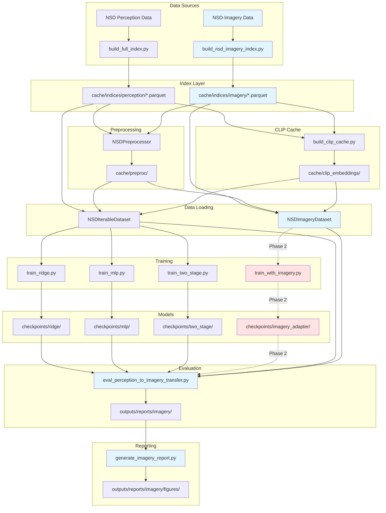

# Imagery Extension Architecture

**System Architecture for NSD-Imagery Integration**

---

## Overview

This document describes how the NSD-Imagery dataset and perception-to-imagery evaluation capabilities integrate into the existing fMRI-to-Image reconstruction pipeline. The design prioritizes **minimal disruption** to existing code while providing **clean extension points** for imagery-specific functionality.

---

## Design Principles

1. **Backwards Compatibility**: All existing perception-only workflows remain unchanged
2. **Shared Infrastructure**: Reuse existing modules (preprocessing, CLIP cache, models) wherever possible
3. **Clear Separation**: Imagery-specific logic isolated in dedicated modules
4. **Unified Interface**: Perception and imagery datasets expose identical APIs
5. **Graceful Degradation**: Scripts fail informatively if imagery data unavailable

---

## System Architecture Diagram



**Legend**:
- **Blue**: New imagery-specific components
- **Red**: Phase 2 (future work)
- **Solid lines**: Implemented dependencies
- **Dashed lines**: Planned dependencies

---

## Module Organization

### New Modules

#### 1. `src/fmri2img/data/nsd_imagery.py`

**Purpose**: Dataset and index-building logic for NSD-Imagery.

**Key Components**:
- `ImageryTrial`: Dataclass for canonical trial representation
- `NSDImageryDataset`: PyTorch Dataset for imagery data (mirrors `NSDIterableDataset`)
- `build_nsd_imagery_index(...)`: Function to construct Parquet indices from raw imagery data

**Interface Compatibility**:
```python
# Perception dataset (existing)
perception_ds = NSDIterableDataset(
    index_path="cache/indices/perception/subj01.parquet",
    subject="subj01",
    preprocessor=preprocessor
)

# Imagery dataset (new, identical interface)
imagery_ds = NSDImageryDataset(
    index_path="cache/indices/imagery/subj01.parquet",
    subject="subj01",
    preprocessor=preprocessor  # Same preprocessor works!
)
```

---

#### 2. `scripts/build_nsd_imagery_index.py`

**Purpose**: CLI tool to build canonical Parquet indices from raw NSD-Imagery data.

**Usage**:
```bash
python scripts/build_nsd_imagery_index.py \
  --subject subj01 \
  --cache-root cache/ \
  --output cache/indices/imagery/subj01.parquet \
  --dry-run  # Preview without writing
```

**Responsibilities**:
- Scan `cache/nsd_imagery/betas/` for beta files
- Parse stimulus metadata from `cache/nsd_imagery/stimuli/`
- Align with existing NSD perception stimuli (validate `nsd_id` matching)
- Write Parquet with canonical schema (see `NSD_IMAGERY_DATASET_GUIDE.md`)

---

#### 3. `scripts/eval_perception_to_imagery_transfer.py`

**Purpose**: Evaluate perception-trained models on imagery test data.

**Usage**:
```bash
python scripts/eval_perception_to_imagery_transfer.py \
  --subject subj01 \
  --checkpoint checkpoints/two_stage/subj01/best.pt \
  --mode imagery \
  --output-dir outputs/reports/imagery/
```

**Modes**:
- `perception`: Evaluate on perception test set (within-domain)
- `imagery`: Evaluate on imagery test set (cross-domain)
- `both`: Run both evaluations and generate comparison

**Output**:
- `perception_baseline_results.json`: Perception test metrics
- `cross_domain_transfer_results.json`: Imagery test metrics
- `comparison_table.csv`: Side-by-side comparison

---

#### 4. `tests/test_imagery_scaffold.py`

**Purpose**: Verify that new modules import correctly and CLIs work.

**Tests**:
- `test_imagery_module_imports`: Check `from fmri2img.data.nsd_imagery import *`
- `test_build_index_cli_help`: Run `python scripts/build_nsd_imagery_index.py --help`
- `test_eval_cli_help`: Run `python scripts/eval_perception_to_imagery_transfer.py --help`
- `test_not_implemented_messages`: Verify informative error messages when functions not yet implemented

**No Real Data Required**: Tests use mocks and dry-runs.

---

## Configuration Changes

### Dataset Configuration (`configs/data.yaml`)

Add new parameters to support imagery:

```yaml
dataset:
  mode: "perception"  # Options: perception | imagery | mixed
  source: "nsd"       # Future: support other datasets
  
  # Index paths (auto-constructed based on mode)
  perception_index: "cache/indices/perception/{subject}.parquet"
  imagery_index: "cache/indices/imagery/{subject}.parquet"
  
  # Split strategy
  split_by: "stimulus"  # Options: stimulus | trial
  # "stimulus": Same stimuli in perception and imagery test sets
  # "trial": Random trial split (may differ across modalities)
  
  # Imagery-specific
  imagery:
    enabled: false  # Set to true when imagery data available
    use_shared_stimuli_only: true  # Restrict to stimuli present in both modalities
    snr_threshold: null  # Filter low-SNR imagery trials if set
```

### Experiment Configuration (`configs/experiments/imagery/`)

New experiment configs for imagery evaluation:

```
configs/experiments/imagery/
├── baseline_evaluation.yaml        # Evaluate existing models on imagery
├── mixed_training.yaml             # Train on perception + imagery (Phase 2)
└── adapter_training.yaml           # Train adapter head (Phase 2)
```

Example `baseline_evaluation.yaml`:
```yaml
experiment:
  name: "perception_to_imagery_baseline"
  description: "Evaluate perception-trained models on imagery test data"
  
model:
  checkpoint: "checkpoints/two_stage/subj01/best.pt"
  type: "two_stage"
  
evaluation:
  test_sets:
    - name: "perception"
      index: "cache/indices/perception/subj01.parquet"
      split: "test"
    - name: "imagery"
      index: "cache/indices/imagery/subj01.parquet"
      split: "test"
  
  metrics:
    - clip_cosine
    - retrieval_at_k: [1, 5, 10, 50]
    - ssim  # Optional if reconstructing images
    - lpips  # Optional
  
output:
  dir: "outputs/reports/imagery/"
  save_predictions: false  # Set true to save embeddings
  generate_figures: true
```

---

## Data Flow

### Phase 1: Evaluation Only (Current Implementation)

```
1. Index Building
   Raw NSD-Imagery files → build_nsd_imagery_index.py → Parquet indices

2. Preprocessing (Shared)
   Parquet indices → NSDPreprocessor → Cached preprocessed betas

3. CLIP Cache (Shared)
   Stimulus IDs → build_clip_cache.py → CLIP embeddings

4. Evaluation
   Existing checkpoints + Imagery indices → eval_perception_to_imagery_transfer.py → Metrics

5. Reporting
   Metrics JSON → generate_imagery_report.py → Figures + Tables
```

### Phase 2: Adapter Training (Future)

```
1. Adapter Training
   Perception checkpoint (frozen) + Imagery train set → train_imagery_adapter.py → Adapter checkpoint

2. Joint Evaluation
   Adapter checkpoint + Test sets → eval_perception_to_imagery_transfer.py → Improved metrics

3. Ablation Studies
   Vary adapter size, training data fraction → Multiple checkpoints → Comparison reports
```

---

## Extension Points

### Adding New Models

To add a new model architecture that supports imagery:

1. **Model Definition**: Add to `src/fmri2img/models/` (e.g., `vision_transformer.py`)
2. **Training Script**: Add to `scripts/` (e.g., `train_vit.py`)
3. **Config**: Add to `configs/training/` (e.g., `vit.yaml`)
4. **Evaluation Support**: Ensure model checkpoint loading works in `eval_perception_to_imagery_transfer.py`

### Adding New Metrics

To add a new evaluation metric:

1. **Metric Function**: Add to `src/fmri2img/eval/metrics.py`
2. **Config Entry**: Add to `configs/experiments/imagery/*.yaml` under `evaluation.metrics`
3. **Reporting**: Update `generate_imagery_report.py` to visualize new metric

### Supporting Other Imagery Datasets

To support datasets beyond NSD-Imagery:

1. **Dataset Module**: Add to `src/fmri2img/data/` (e.g., `bold5000_imagery.py`)
2. **Index Builder**: Add script to `scripts/` (e.g., `build_bold5000_imagery_index.py`)
3. **Config**: Add `dataset.source: "bold5000"` option in `configs/data.yaml`

---

## Failure Modes & Error Handling

### Missing Imagery Data

**Scenario**: User tries to run imagery evaluation without imagery indices.

**Handling**:
```python
if not Path(imagery_index_path).exists():
    raise FileNotFoundError(
        f"Imagery index not found: {imagery_index_path}\n"
        f"Please run: python scripts/build_nsd_imagery_index.py --subject {subject}"
    )
```

### Model-Data Mismatch

**Scenario**: User tries to load a checkpoint trained on different subject.

**Handling**:
```python
checkpoint_subject = checkpoint_metadata["subject"]
if checkpoint_subject != args.subject:
    logger.warning(
        f"Checkpoint trained on {checkpoint_subject}, evaluating on {args.subject}. "
        f"Cross-subject transfer may perform poorly."
    )
```

### Insufficient Imagery Samples

**Scenario**: Imagery test set has <50 samples (too small for reliable metrics).

**Handling**:
```python
if len(imagery_test_set) < 50:
    logger.warning(
        f"Imagery test set has only {len(imagery_test_set)} samples. "
        f"Metrics may have high variance. Consider using more data."
    )
```

---

## Performance Considerations

### Memory Optimization

- **Lazy Loading**: Use `NSDImageryDataset` with `IterableDataset` pattern (same as perception)
- **CLIP Cache**: Share same cache for perception and imagery (keyed by `nsd_id`)
- **Preprocessing Cache**: Share same cache for perception and imagery

### Compute Optimization

- **Batching**: Imagery evaluation uses same batch sizes as perception
- **Multi-GPU**: Same distributed training support (if implemented in Phase 2)
- **Caching**: Pre-compute CLIP embeddings and preprocessing once, reuse across experiments

---

## Testing Strategy

### Unit Tests
- `tests/test_imagery_scaffold.py`: Module imports and CLI smoke tests
- `tests/test_nsd_imagery.py`: Dataset class functionality (with mocked data)

### Integration Tests
- `tests/test_imagery_pipeline.py`: End-to-end evaluation with small synthetic dataset

### Validation Tests
- `scripts/validate_imagery_index.py`: Check index consistency (trial counts, nsd_id alignment)

---

## Future Enhancements (Phase 2+)

1. **Adapter Training Pipeline**: Implement lightweight adapter head training
2. **Mixed Training**: Train models on combined perception + imagery data
3. **Cross-Subject Transfer**: Evaluate models trained on one subject, tested on another
4. **Attention Analysis**: Visualize which brain regions drive imagery decoding
5. **Uncertainty Quantification**: Provide confidence intervals for imagery predictions

---

## References

- **Existing Pipeline**: See `docs/architecture/PIPELINE_ARCHITECTURE.md`
- **Data Details**: See `docs/technical/NSD_IMAGERY_DATASET_GUIDE.md`
- **Research Context**: See `docs/research/PERCEPTION_VS_IMAGERY_ROADMAP.md`

---

**Status**: Phase 1 (Documentation + Scaffolding) — In Progress  
**Last Updated**: January 10, 2026
