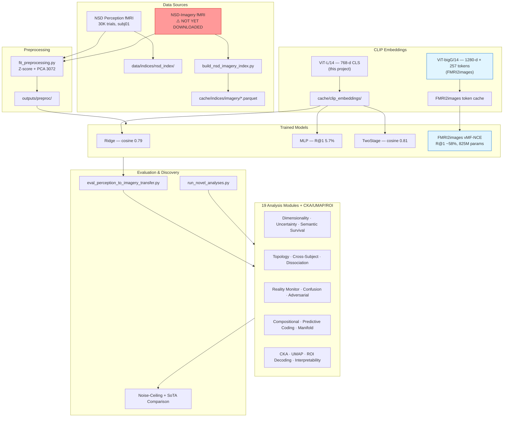

# Imagery Extension Architecture

**System Architecture for NSD-Imagery Integration & Cross-Project Discovery**

> Last Updated: March 12, 2026 — v0.3.0

---

## Overview

This document describes how the NSD-Imagery dataset, perception-to-imagery evaluation, and cross-project model integration fit into the fMRI decoding pipeline. The system is built for **scientific discovery** — comparing how the brain represents perceived vs. imagined visual content — not just model building.

### Current State

| Component | Status | Notes |
|-----------|--------|-------|
| **28 perception models** | Trained | Ridge, MLP (11 configs), TwoStage (10), Multilayer (4), Adapters (3) |
| **19 analysis modules** | Code complete | All validated with dry-run / synthetic data; awaiting imagery data |
| **4 advanced losses** | Tested | VICReg, Barlow Twins, Triplet+InfoNCE, Hard Negative Mining |
| **CKA analysis** | Tested | Linear/RBF kernels, debiased HSIC, cross-condition comparison |
| **LoRA adapters** | Tested | Multi-rank LoRA for parameter-efficient perception→imagery transfer |
| **Domain adversarial** | Tested | Gradient reversal + DANN for domain-invariant representations |
| **Noise-ceiling normalization** | Tested | Ceiling-relative metrics for fair cross-study comparison |
| **UMAP/t-SNE visualization** | Tested | Density comparison, perception vs imagery manifold plots |
| **ROI decoding** | Tested | Per-ROI Ridge decoding with hierarchy barplots |
| **Interpretability** | Tested | Integrated Gradients, SmoothGrad, Grad×Input |
| **SoTA comparison** | Tested | 8 published baselines, LaTeX table generation |
| **NSD-Imagery data** | **NOT DOWNLOADED** | Critical blocker for all cross-domain analyses |
| **Cross-project bridge** | Planned | Load FMRI2images vMF-NCE model (R@1~58%, CSLS~70%) |

---

## Design Principles

1. **Discovery-First**: The goal is scientific findings about perception vs. imagination, not novel architectures
2. **Backwards Compatibility**: All existing perception-only workflows remain unchanged
3. **Cross-Project Integration**: Leverage the stronger FMRI2images encoder (vMF-NCE, ViT-bigG/14) for analysis
4. **Shared Infrastructure**: Reuse preprocessing, CLIP cache, and evaluation across both projects
5. **Graceful Degradation**: Scripts fail informatively if imagery data or external checkpoints are unavailable

---

## System Architecture


```mermaid
flowchart TD
    subgraph Data["Data Sources"]
        A[NSD Perception fMRI<br/>30K trials, subj01] --> C[data/indices/nsd_index/]
        B["NSD-Imagery fMRI<br/>⚠️ NOT YET DOWNLOADED"] --> D[build_nsd_imagery_index.py]
        D --> F[cache/indices/imagery/*.parquet]
    end

    subgraph Preproc["Preprocessing"]
        A --> G["fit_preprocessing.py<br/>Z-score + PCA 3072"]
        B --> G
        G --> H[outputs/preproc/]
    end

    subgraph CLIP["CLIP Embeddings"]
        I["ViT-L/14 — 768-d CLS<br/>(this project)"] --> J[cache/clip_embeddings/]
        K["ViT-bigG/14 — 1280-d × 257 tokens<br/>(FMRI2images)"] --> L[FMRI2images token cache]
    end

    subgraph Models["Trained Models"]
        M1["Ridge — cosine 0.79"]
        M2["MLP — R@1 5.7%"]
        M3["TwoStage — cosine 0.81"]
        M5["FMRI2images vMF-NCE<br/>R@1 ~58%, 825M params"]
    end

    subgraph Analysis["19 Analysis Modules + CKA/UMAP/ROI"]
        N1[Dimensionality · Uncertainty · Semantic Survival]
        N2[Topology · Cross-Subject · Dissociation]
        N3[Reality Monitor · Confusion · Adversarial]
        N4[Compositional · Predictive Coding · Manifold]
        N5[CKA · UMAP · ROI Decoding · Interpretability]
    end

    subgraph Eval["Evaluation & Discovery"]
        E1[eval_perception_to_imagery_transfer.py]
        E2[run_novel_analyses.py]
        E3[Noise-Ceiling + SoTA Comparison]
    end

    H --> Models
    J --> M1 & M2 & M3
    L --> M5
    Models --> E1
    E1 --> Analysis
    E2 --> Analysis
    Analysis --> E3

    style B fill:#ff9999,stroke:#cc0000
    style M5 fill:#e1f5ff,stroke:#0066cc
    style K fill:#e1f5ff,stroke:#0066cc
```

---

## The Two Projects

### This Project: `perceptionVSimagination` (v0.3.0)

| Aspect | Details |
|--------|---------|
| **CLIP model** | ViT-L/14 (OpenAI), 768-d CLS embeddings |
| **Input** | PCA-reduced features (3072-d) from z-scored NSD betas |
| **Best model** | MLP `strong_infonce_v2` — R@1=5.7%, cosine=0.79 (test-split) |
| **Models trained** | 28 configs across Ridge, MLP, TwoStage, Multilayer, Adapters |
| **Focus** | Cross-domain transfer analysis, perception-imagery comparison |

### FMRI2images (separate codebase)

Located at `/home/jovyan/work/FMRI2images/` on the H100 cluster.

| Aspect | Details |
|--------|---------|
| **CLIP model** | ViT-bigG/14 (LAION-2B), 1280-d × 257 tokens = 328,960-d |
| **Input** | 15,724 raw voxels (nsdgeneral ROI), no PCA |
| **Architecture** | 4-layer residual MLP [8192, 8192, 4096, 2048] → vMF decoder (825M params) |
| **Training** | vMF-NCE + SoftCLIP + MixCo + EMA, queue size 1024, bf16 |
| **Best checkpoint** | `N1v27a_bigg_tokens/subj01/checkpoint_best.pt` |
| **Metrics** | R@1 ~58%, CSLS R@1 ~70% (continuing to improve) |

### Integration Strategy

Rather than porting architectures, we use each model's **predictions as scientific probes**:

1. Both models predict embeddings for the same stimuli (perceived and imagined)
2. Compare: Does the stronger model show the same perception-vs-imagery patterns?
3. **If consistent**: Findings are robust — a genuine neural phenomenon
4. **If different**: Model quality mediates the finding — itself a contribution

---

## Module Organization

### Data Modules

| Module | Purpose |
|--------|---------|
| `src/fmri2img/data/nsd_imagery.py` | NSD-Imagery dataset + index builder (mirrors perception API) |
| `scripts/build_nsd_imagery_index.py` | CLI to build Parquet indices from raw imagery betas |

### Evaluation Scripts

| Script | Purpose |
|--------|---------|
| `scripts/eval_perception_to_imagery_transfer.py` | Cross-domain evaluation (perception → imagery) |
| `scripts/run_novel_analyses.py` | Orchestrate all 15 analysis directions |
| `scripts/make_novel_figures.py` | Publication-quality figures from analysis results |
| `scripts/make_paper_figures.py` | Paper-specific figure generation |

### 19 Analysis Directions

All in `src/fmri2img/analysis/`:

| # | Module | Key Question | Status |
|---|--------|-------------|--------|
| 1 | `dimensionality.py` | Does imagery compress the perceptual manifold? | Code ✅ |
| 2 | `imagery_uncertainty.py` | Does MC Dropout uncertainty track imagery vividness? | Code ✅ |
| 3 | `semantic_decomposition.py` | Which semantic concepts survive imagination? | Code ✅ |
| 4 | `topological_rsa.py` | Does imagination restructure representational topology? | Code ✅ |
| 5 | `cross_subject.py` | Does the imagery gap have a subject-specific fingerprint? | Code ✅ |
| 6 | `semantic_structural_dissociation.py` | Do semantics survive while structure degrades? | Code ✅ |
| 7 | `reality_monitor.py` | Can PRM theory predict perception-imagery confusability? | Code ✅ |
| 8 | `reality_confusion.py` | Where is the boundary between perceived and imagined? | Code ✅ |
| 9 | `adversarial_reality.py` | Can a discriminator tell perception from imagery? | Code ✅ |
| 10 | `hierarchical_reality.py` | At which layer does the perception-imagery gap emerge? | Code ✅ |
| 11 | `compositional_imagination.py` | Can imagination compose novel concepts? | Code ✅, Dry-run ✅ |
| 12 | `predictive_coding.py` | Does imagery follow top-down information flow? | Code ✅, Dry-run ✅ |
| 13 | `manifold_geometry.py` | Is there a centrality bias in imagery? | Code ✅, Dry-run ✅ |
| 14 | `modality_decomposition.py` | What's shared vs. unique between modalities? | Code ✅, Dry-run ✅ |
| 15 | `creative_divergence.py` | What transformation rules govern imagination? | Code ✅, Dry-run ✅ |

### Advanced Research Modules (v0.3.0)

| Module | Location | Purpose |
|--------|----------|---------|
| **CKA** | `analysis/cka.py` | Centered Kernel Alignment — layer-wise representation comparison |
| **UMAP/t-SNE** | `analysis/embedding_visualization.py` | Perception vs imagery manifold visualization |
| **ROI Decoding** | `analysis/roi_decoding.py` | Per-brain-region decoding accuracy |
| **Interpretability** | `analysis/interpretability.py` | Integrated Gradients, SmoothGrad, Grad×Input |
| **VICReg** | `training/losses.py` | Variance-Invariance-Covariance regularization |
| **Barlow Twins** | `training/losses.py` | Redundancy reduction loss |
| **Triplet+InfoNCE** | `training/losses.py` | Combined contrastive + triplet with hard negatives |
| **DANN** | `training/domain_adversarial.py` | Domain adversarial training for invariant features |
| **LoRA** | `models/lora_adapter.py` | Low-Rank Adaptation for parameter-efficient transfer |
| **Noise Ceiling** | `eval/ceiling_normalized.py` | Normalize metrics against theoretical maximum |
| **SoTA Comparison** | `eval/sota_comparison.py` | 8 published baselines, LaTeX table generation |
| **FDR Correction** | `stats/inference.py` | Benjamini-Hochberg and Bonferroni correction |

---

## Configuration

### Dataset (`configs/data.yaml`)

```yaml
dataset:
  mode: "perception"     # perception | imagery | mixed
  source: "nsd"
  imagery:
    enabled: false       # Set true when NSD-Imagery data is downloaded
    use_shared_stimuli_only: true
```

### Analysis (`configs/experiments/novel_analyses.yaml`)

All 15 original analysis directions configured with hyperparameters.

### Cross-Domain (`configs/experiments/perception_to_imagery_eval.yaml`)

Imagery indices and model checkpoints for transfer evaluation.

---

## Data Flow: From Data to Discovery

```
1. Acquire NSD-Imagery Data         ← CURRENT BLOCKER
   OpenNeuro ds004937 or NSD S3 → /home/jovyan/work/data/nsd_imagery/

2. Build Imagery Index
   build_nsd_imagery_index.py → cache/indices/imagery/*.parquet

3. Preprocess
   fit_preprocessing.py → Z-score + PCA(3072)

4. Evaluate Transfer (H1)
   eval_perception_to_imagery_transfer.py → outputs/reports/imagery/

5. Run Analyses (15 directions)
   run_novel_analyses.py → outputs/novel_analyses/

6. Generate Figures
   make_novel_figures.py → Publication-ready plots

7. Cross-Project Comparison
   External model loader → Run same analyses with FMRI2images predictions
```

---

## Error Handling

```python
# Missing imagery data
if not Path(imagery_index_path).exists():
    raise FileNotFoundError(
        f"Imagery index not found: {imagery_index_path}\n"
        f"See docs/technical/NSD_IMAGERY_DATASET_GUIDE.md for data acquisition"
    )

# Cross-subject mismatch
if checkpoint_subject != args.subject:
    logger.warning(f"Checkpoint trained on {checkpoint_subject}, evaluating on {args.subject}")

# Small sample warning
if len(imagery_test_set) < 50:
    logger.warning(f"Only {len(imagery_test_set)} imagery samples — high variance risk")
```

---

## Testing

All 51+ tests pass without real NSD data:

```bash
pytest tests/ -v                          # Full suite
pytest tests/test_imagery_scaffold.py -v  # Scaffold
pytest tests/test_cka.py -v               # CKA (11 tests)
pytest tests/test_novel_losses.py -v      # VICReg, Barlow, Triplet (17 tests)
pytest tests/test_lora.py -v              # LoRA adapters (12 tests)
pytest tests/test_fdr.py -v               # FDR correction (11 tests)
```

---

## References

- [PERCEPTION_VS_IMAGERY_ROADMAP.md](../research/PERCEPTION_VS_IMAGERY_ROADMAP.md) — Research plan
- [EXPERIMENT_RESULTS.md](../research/EXPERIMENT_RESULTS.md) — Perception model results
- [EXPERIMENT_CONTEXT.md](../research/EXPERIMENT_CONTEXT.md) — Living experiment log
- [NSD_IMAGERY_DATASET_GUIDE.md](../technical/NSD_IMAGERY_DATASET_GUIDE.md) — Data format
- [CLUSTER_ENVIRONMENT.md](../guides/CLUSTER_ENVIRONMENT.md) — Cluster setup
- [STATUS.md](../research/STATUS.md) — Single source of truth for project status
